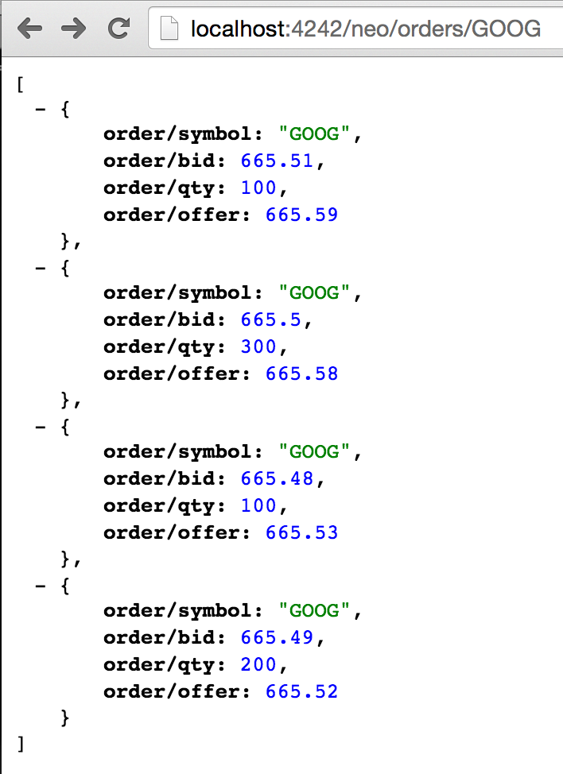
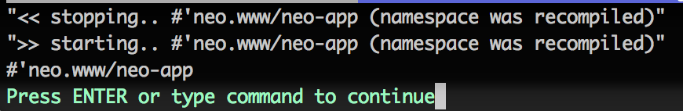
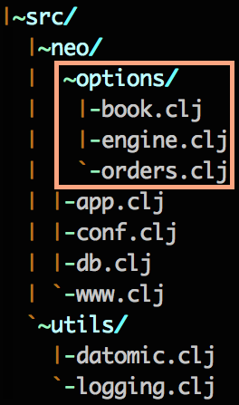
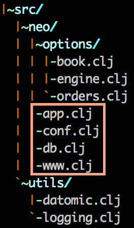

## stater

sample [mount](https://github.com/tolitius/mount) based apps

## Neo Options Exchange

###### [desing pic... coming]

### Boot Neo

```clojure
$ cd neo

$ boot repl
boot.user=>

boot.user=> (dev)
#object[clojure.lang.Namespace 0x371d0df1 "dev"]

dev=> (reset)
INFO  utils.logging - >> starting..  #'neo.conf/config
INFO  utils.logging - >> starting..  #'neo.db/conn
INFO  neo.db - creating a connection to datomic: datomic:mem://neo
INFO  utils.logging - >> starting..  #'neo.www/neo-app
INFO  utils.logging - >> starting..  #'neo.app/nrepl
{:started ["#'neo.conf/config" "#'neo.db/conn" "#'neo.www/neo-app" "#'neo.app/nrepl"]}
dev=>
```

### Stage the Order Book

```clojure
dev=> (stage-order-book conn orders)
({:db-before datomic.db.Db@3ff443a5, :db-after datomic.db.Db@dfffb0d... })
```

### Find Orders

via REPL:

```clojure
dev=> (find-orders conn "GOOG")
({:db/id 17592186045418, :order/symbol "GOOG", :order/bid 665.51M, :order/qty 100, :order/offer 665.59M}
 {:db/id 17592186045420, :order/symbol "GOOG", :order/bid 665.50M, :order/qty 300, :order/offer 665.58M}
 {:db/id 17592186045422, :order/symbol "GOOG", :order/bid 665.48M, :order/qty 100, :order/offer 665.53M}
 {:db/id 17592186045424, :order/symbol "GOOG", :order/bid 665.49M, :order/qty 200, :order/offer 665.52M})

dev=> (find-orders conn "TSLA")
({:db/id 17592186045426, :order/symbol "TSLA", :order/bid 232.38M, :order/qty 200, :order/offer 232.43M}
 {:db/id 17592186045428, :order/symbol "TSLA", :order/bid 232.41M, :order/qty 100, :order/offer 232.46M})
dev=>
```

via HTTP GET [http://localhost:4242/neo/orders/GOOG](http://localhost:4242/neo/orders/GOOG)




### Match Quotes

As of right now Neo is undergoing his initial training, and it will only return the total order _quantity that was matched_ accross all the orders in the book.

All match requests do hit Neo's ultra low speed matching engine.

via REPL:

```clojure
dev=> (def quote {:ticker "GOOG", :bid 665.54M, :offer 665.58M :qty 400})
#'dev/quote
dev=> (match-quote quote (find-orders conn "GOOG"))
300
```

The quote's `offer` matched nothing, the `bid` matched two of the orders (their `offers` <= quote's `bid`) in the book:

```clojure
{:db/id 17592186045422, :order/symbol "GOOG", :order/bid 665.48M, :order/qty 100, :order/offer 665.53M}
{:db/id 17592186045424, :order/symbol "GOOG", :order/bid 665.49M, :order/qty 200, :order/offer 665.52M})
```

The quote's quantity is `400`, `300` of which matched, hence total matched quantity is `300`.

via HTTP GET [http://localhost:4242/neo/match-quote?ticker=GOOG&qty=500&bid=665.54&offer=665.58](http://localhost:4242/neo/match-quote?ticker=GOOG&qty=500&bid=665.54&offer=665.58):


### "Neo Reload"

At any given point Neo can be reloaded from the REPL:

```clojure
dev=> (reset)
INFO  utils.logging - << stopping..  #'neo.app/nrepl
INFO  utils.logging - << stopping..  #'neo.www/neo-app
INFO  utils.logging - << stopping..  #'neo.db/conn
INFO  neo.db - disconnecting from  datomic:mem://neo
INFO  utils.logging - << stopping..  #'neo.conf/config
:reloading ()
INFO  utils.logging - >> starting..  #'neo.conf/config
INFO  neo.conf - loading config from dev/resources/config.edn
INFO  utils.logging - >> starting..  #'neo.db/conn
INFO  neo.db - conf:  {:datomic {:uri datomic:mem://neo}, :www {:port 4242}, :h2 {:classname org.h2.Driver, :subprotocol h2, :subname jdbc:h2:mem:mount, :user sa, :password }, :rabbit {:api-port 15672, :password guest, :queue r-queue, :username guest, :port 5672, :node jabit, :exchange-type direct, :host 192.168.1.1, :vhost /captoman, :auto-delete-q? true, :routing-key , :exchange foo}, :nrepl {:host 0.0.0.0, :port 7878}}
INFO  neo.db - creating a connection to datomic: datomic:mem://neo
INFO  utils.logging - >> starting..  #'neo.www/neo-app
INFO  utils.logging - >> starting..  #'neo.app/nrepl
{:started ["#'neo.conf/config" "#'neo.db/conn" "#'neo.www/neo-app" "#'neo.app/nrepl"]}
dev=>
```

#### On Neo Namespace Recompile

In case a namespace that was recompiled has a `defstate` in it, mount will clean it up and restart after the namespace was recompiled:



(more details on ns recompilation [here](https://github.com/tolitius/mount#recompiling-namespaces-with-running-states))

## Neo Business

Neo business logic does not have `defstate`s and lives in its own gated neighborhood:



options/ `book`, `engine` and `order` live a full, happy referentially transparent life.

## Neo States

When you call `(mount/start)` or `(reset)`, mount tells you what states were started:

```clojure
dev=> (mount/start)
{:started ["#'neo.conf/config" "#'neo.db/conn" "#'neo.www/neo-app" "#'neo.app/nrepl"]}
dev=>
```

You can easily correlate all these states to their homes:



It does not mean that each state should live in its separate namespaces, 
but it's always a good idea to start with that, since, at least in this example, those are different external resources.
