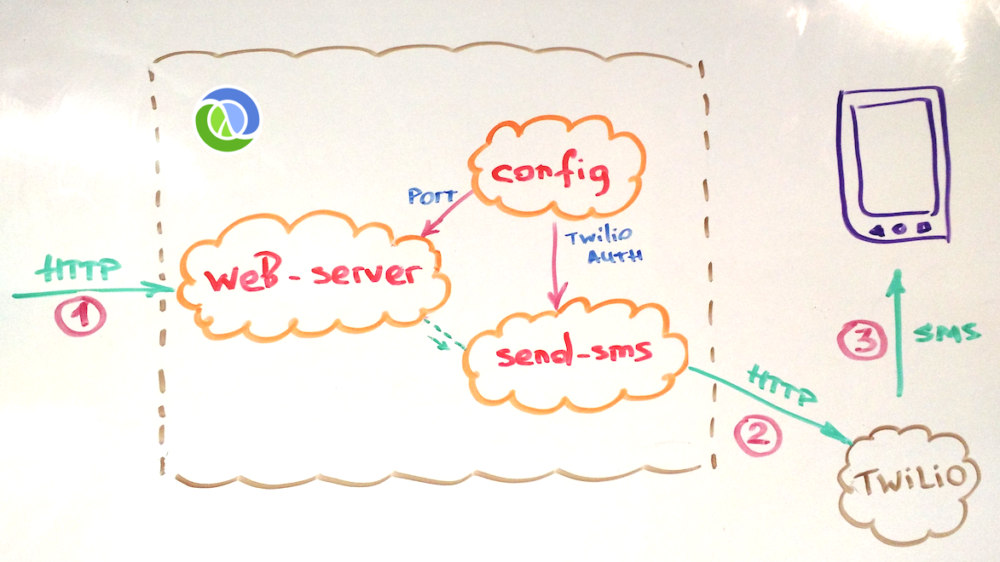
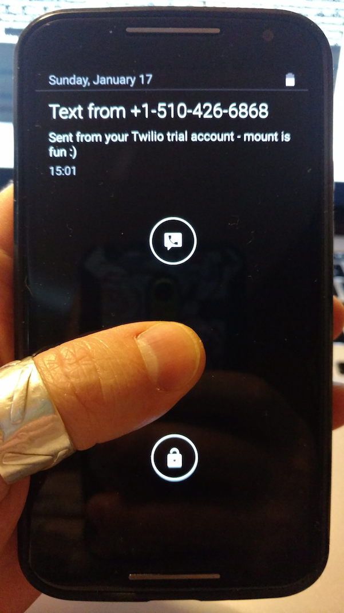

# smsio

Sending SMS messages via HTTP with [Twilio](https://github.com/owainlewis/twilio)

This app demonstrates how a state can be just a funciton as well as how states can be swapped for testing.

<div style="text-align:center"></div>

## Sending Texts

In order to send SMS, you would need to create/add your [Twilio creds](https://www.twilio.com/help/faq/twilio-basics/what-is-the-auth-token-and-how-can-i-change-it)
to the smsio [config](dev/resources/config.edn#L4)

After that is done, texting is pretty simple.

### Boot smsio with Boot

Change directory root to smsio, and:

```clojure
[smsio]$ boot repl
boot.user=> (dev)
#object[clojure.lang.Namespace 0x53810ad6 "dev"]
dev=> (reset)
INFO  utils.logging - >> starting..  #'app.conf/config
INFO  utils.logging - >> starting..  #'app.sms/send-sms
INFO  utils.logging - >> starting..  #'app.www/web-server
{:started ["#'app.conf/config" "#'app.sms/send-sms" "#'app.www/web-server"]}
dev=>
```

### Send HTTP POST to smsio

The easiest way is to use `curl`. The format is:

```clojure
;; as compojure reads it..
(POST "/sms/:from/:to/:msg")
```

(replace the phone numbers with your Twilio and recipient ones):

```clojure
curl -X POST "http://localhost:4242/sms/+15104266868/+17180000000/mount%20is%20fun%20:)"
```

and...



I am sure you noticed, but the Twilio phone number this SMS is sent from is:

`+ 1 (510) 42 MOUNT` :)

## Swapping SMS sender for testing

The reason for this example is to show how to test by swapping states with their mocks / stubs.

Every app is different, and states to swap will also be different. We are going to replace a [send-sms state](https://github.com/tolitius/stater/blob/master/smsio/src/app/sms.clj#L12) that is defined in the app as: 

```clojure
(defn create-sms-sender [{:keys [sid auth-token]}]
  (fn [{:keys [from to body]}]
    (twilio/with-auth sid auth-token
      (twilio/send-sms 
        (twilio/sms from to body)))))

(defstate send-sms :start (create-sms-sender 
                            (:sms config)))
```

notice that, once started, the `send-sms` will be just a funciton. Which means that if it is needed to be replaced during testing, it can be replaced with a test function that, for example, receives an SMS and puts in on a core.async channel:

```clojure
(fn [sms] 
  (go (>! sms-ch sms)))
```

One thing to note, the real `twilio/send-sms` returns a future, so in order to be (if needed) as close as possble to the "real thing", we'll also return a future:

```clojure
(fn [sms] 
  (go (>! sms-ch sms))
  (future))
```

### Testing by Swapping

Now all that needs to be done is to create a test function and let mount know to use it instead if the real one.

```clojure
;; ...
(let [sms-ch (chan)
      send-sms (fn [sms] (go (>! sms-ch sms))
                 (future))]                        ;; twilio API returns a future
  (mount/start-with {#'app.sms/send-sms send-sms})
;; ...
```

We can do it from within a test file:

```clojure
(deftest swapping-with-value
  (testing "sms endpoint should send sms"
    (let [sms-ch (chan)
          send-sms (fn [sms] (go (>! sms-ch sms))
                     (future))]                        ;; twilio API returns a future
      (mount/start-with {#'app.sms/send-sms send-sms})
      (http/post (post-sms-url "mars" "earth" "we found a bottle of scotch!"))
      (is (= "we found a bottle of scotch!"
             (:body (<!! sms-ch)))))
    (mount/stop)))
```

In this test all the application components work with a test `send-sms` function rather than the real one.
In other (more OO) words, mount injected a test `send-sms` into an app _instead of_ the real one.

Check out the [working test](https://github.com/tolitius/stater/blob/master/smsio/test/app/test/app.clj) to get a visual on how all the above pieces come together.

### Running tests is easy:

```clojure
[smsio]$ boot test
```
